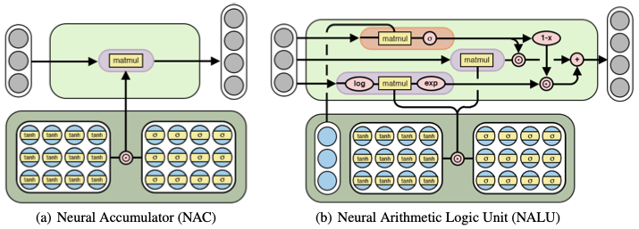
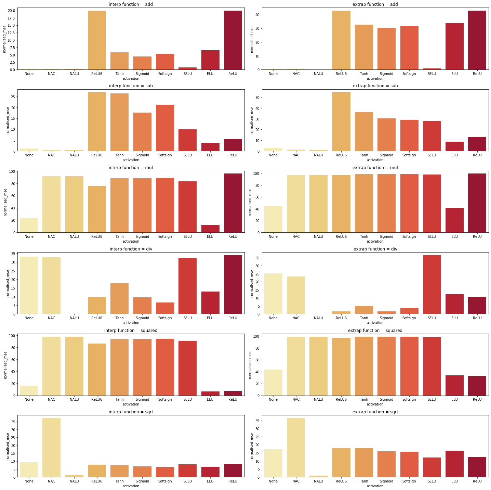

# torchNALU

<p align=center>

</p>

Code in this repository provides a PyTorch implementation of the
[**Neural Arithmetic Logic Units**](https://arxiv.org/abs/1808.00508)
paper from Deepmind. The results produced align with those described
within the paper, demonstrating the effectiveness of the `NALU/NAC`
architectures.

## **Experiments:**

To reproduce the results for a static task, run:

```bash
python3 network.py
```

The graphs below show the *MSE* normalised with respect to the results
obtained from a random MLP network such that 100.0 is equivalent to
random, 0.0 is perfect accuracy, and >100.0 is worse than a randomly
initialised model.

<p align=center>

</p>

## **References:**

```
@misc{trask2018neural,
    title={Neural Arithmetic Logic Units},
    author={Andrew Trask and Felix Hill and Scott Reed and Jack Rae and Chris Dyer and Phil Blunsom},
    year={2018},
    eprint={1808.00508},
    archivePrefix={arXiv},
    primaryClass={cs.NE}
}
```

###### PyTorch implementation of **[Neural Arithmetic Logic Units](https://arxiv.org/abs/1808.00508)**<br>Made by Daniel Kelshaw
